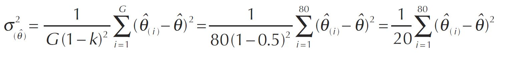
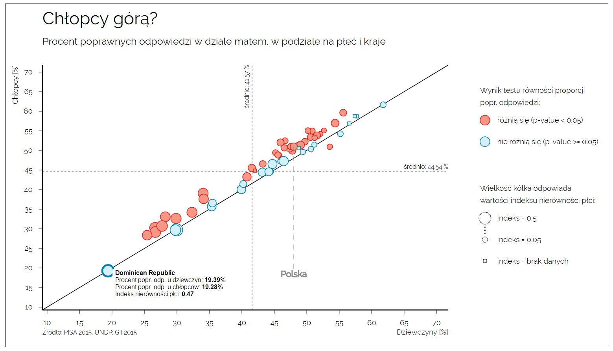

```{r setup, include=FALSE}
knitr::opts_chunk$set(echo = TRUE)
knitr::opts_knit$set(root.dir = "C:/Users/E540/Desktop/PISA 2015/zadanie0")
library(knitr)
```


# Dodawanie wag do zbioru

## Wybieranie wag ze zbioru z kwestionariuszem

Ze zbioru Cy6_ms_cmb_stu_qqq.sav wybrałyśmy przy pomocy skryptu SAS-owego Z0_QQQ_wagi.sas kolumny z wagami (zmienne: W_FSTUWT oraz W_FSTURWT1:W_FSTURWT80) wraz z odpowiednimi kolumnami-kluczami (CNTSCHID oraz CNTSTUID). W wyniku wykonania tego skryptu został utworzony plik CY6_MS_CMB_STU_QQQ_wagi.csv zawierający 447400 obserwacji oraz 83 zmienne:

```{r, message=F, warning=F }
library(knitr)
wagi <- read.csv("CY6_MS_CMB_STU_QQQ_wagi.csv")
kable(head(wagi[,c(1:7)],5))
```

## Dodawanie wag do zbiorów głównych i tworzenie plików ze statystykami

Wykorzystując wcześniej stworzony zbiór dołączono kolumny z wagami do głównych zbiorów: Z0_matem.rda, Z0_read.rda oraz Z0_science.rda, tworząc zbiory Z0_matem_w.rda, Z0_read_w.rda oraz Z0_science_w.rda o 99 kolumnach.

Dodatkowo utworzono dla każdego ze zbiorów (działów) pomocniczy dokument xlsowy, w którym w oddzielnych arkuszach umieszczono ważone statystyki dla każdego z pytań z odpowiedniego działu dla każdego kraju oraz łączne statystyki dla całego pytania (CNT = TOTAL).

Przykład takiego pojedynczego arkusza:

```{r, message=F, warning=F}
library(readxl)   
podglad <- read_excel("stat_matem_3.xlsx", sheet = "M00GQ01")
kable(head(podglad,10))
```

Obie czynności zostały wykonane przy użyciu skryptu Z3_1.r.

# Wizualizacja

## Część 1

## Część 2 - wyniki w działach M R i S w podziale na kraje i płeć

Przy pomocy skryptu Z3_2_plec.R przygotowano odpowiednie dane potrzebne do wygenerowania 3 wykresów dot.poprawnych odpowiedzi na pytania z 3 działów w podziale na płeć i kraje. Wygenerowane dane miały postać 

      a) ramki danych zawierającej średnie ważone procenty poprawnych odpowiedzi w podziale na płeć dla danego działu np.
      
```{r,message=F, warning=F}
load("total.rda")
kable(total)
```

      b) ramki danych zawierającej dla danego działu dla wszystkich krajów: 
      
      CNT - skrótowa nazwa kraju
      
      nazwa - pełna nazwa kraju
      
      GII - indeks nierówności płci (ze strony http://hdr.undp.org/en/composite/GII)
      
      M - średni ważony procent popr. odpowiedzi dla mężczyzn
      
      F - średni ważony procent popr. odpowiedzi dla kobiet
      
      czyIstotny - wynik dwustronnego testu równości powyższych proporcji (na poziomie alfa = 0.05)
      
```{r,message=F, warning=F}
load("dane_plec.rda")
kable(head(dane_plec,8))
```

Odchylenie standardowe użyte przy liczeniu statystyki testowej testu równości proprocji zostało policzone przy użyciu wzoru:


Gotowe wykresy interaktywne są dostępne w plikach: "wykres matem.html", "wykres read.html", "wykres science.html". Zostały one stworzone na podstawie powyższych 2 ramek danych (po wcześniejszym ich przekonwertowaniu do obiektów/tablic JS) przy użyciu biblioteki D3.js.

Wersja statyczna takiej grafiki dla działu matematycznego wygląda następująco (w wersji interaktywnej dostępne są tooltipy po najechaniu na kółko lub kwadrat, pokazujące wartości zmiennych użytych do wygenerowania danego punktu):


Na wykresie na osi poziomej umieszczono procent poprawnych odpowiedzi na pytania z działu matematycznego dla dziewczyn, a na osi pionowej analogiczne liczby dla chłopców. Kółkami (lub kwadracikami) zaznaczono te proprocje dla poszczególnych krajów. Kolor kształtu zależy od wyniku testu równości proporcji popr. odpowiedzi, natomiast kształt i wielkość punktów zależy od indeksu GII (indeksu nierówności płci), udostępnionego przez ONZ (kwadrat oznacza brak danych na temat GII dla danego państwa). Dodatkowo na wykresie umieszczono adnotację pozwalającą szybko zlokalizować Polskę oraz linie ogólnych ważonych średnich procentów popr. odpowiedzi dla obu płci, aby można był np. ocenić czy dziewczynki i/lub chłopcy w Polsce radzą sobie lepiej czy gorzej od średniej.

Wnioski:

      a) dodanie indeksu GII miało sprawdzić czy punkty, które są mocno oddalone od linii y=x będą miały również większy indeks GII oznaczający większą nierówność płciową w danym kraju; okazało się jednak, patrząc na wykresy, że istnieje raczej tendencja, pokazująca, że dla krajów o niższych procentach poprawnych odp., występuje wyższa nierówność płciowa
      
      b) dla działu matematycznego wydaje się, że w większości krajów chłopcy radzą sobie lepiej niż dziewczynki w matematyce, choć wiele wyników mimo odchylenia od prostej y=x, pozostaje nieistotna statystycznie
      
      c) dla działu czytania: we wszystkich krajach (poza 3 krajami, dla których test nie wykazał istotnej statystycznie róznicy proporcji) dziewczynki radziły sobie lepiej od chłopców
      
      d) dla działu przyrodniczego nie ma jednoznacznej przewagi żadnej z płci
      
      e) najlepsze wyniki w każdym z działów osiągał Singapur, natomiast najgorsze Dominikana
      
      f) Polska w każdym z działów reprezentowała wysoki poziom - była powyżej średnich dla każdej z płci


## Część 3 - czasy odp. i proc. popr. odp. w działach M R i S

Przy pomocy skryptu Z3_3.R przygotowano odpowiednie dane potrzebne do wygenerowania 3 wykresów dot. czasów odpowiedzi oraz procentów poprawnych odpowiedzi na pytania z 3 działów. Wygenerowane dane miały postać:

      a) ramki danych zawierającej dla danego działu
      
      item_short - nazwa pytania
      
      VARLABEL - treść pytania z Codebook
      
      ProcFullCredit - ważony procent poprawnych odpowiedzi na dane pytanie
      
      N - ilość odpowiedzi na dane pytanie
      
      TimeAvgMin - średni ważony czas odpowiedzi na pytania w min
      
      std - odchylenie standardowe proc. popr. odp. wśród krajów odpowiadających na dane pytanie
      
      rankingPolska - wynik Polski dla danego pytania (pozycja)
      
      top1 - kraj, który osiągnął najlepszy wynik dla danego pytania
      
      top2 - kraj, który osiągnął drugi najlepszy wynik dla danego pytania
      
      top3 - kraj, który osiągnął trzeci najlepszy wynik dla danego pytania
      
```{r, message=F, warning=F}
load(file="daneMatem_pytania.rda")
kable(head(daneMatem,8))
```

UZUPEŁNIĆ: opis wykresu, nazwy plików z wykresami, obrazek poglądowy, wnioski

Wnioski:

         pytania różniły się między sobą znacznie czasem odpowiedzi (od 1 do 4 min)
         
         pytania różniły się między sobą trudnością (patrząc po proc. popr. odpowiedzi)

         pytania różniły się między sobą ilością wystąpień (nie każde pytanie zostało zadane uczniom mniej więcej tyle samo razy)
         
         pytania miały zróżnicowaną trudność dla różnych krajów, te bardzo łatwe i te bardzo trudne były w miarę dla wszystkich łatwe i trunde; pytania o średniej trudności miały największy zróżnicowanie wyników krajów

# Skrypty:

## Z0_QQQ_wagi.sas

```{r,eval=F}
/*********************************************************
importowanie pliku: Cy6_ms_cmb_stu_qqq.sav

folder_IN - sciezka do folderu zawierajacego plik Cy6_ms_cmb_stu_qqq.sav
folder_OUT - sciezka do folderu do zapisu pliku wyjściowego
***********************************************************/

%let folder_IN = C:\Users\E540\Desktop\PISA 2015\dokumentacja\;
%let folder_OUT = C:\Users\E540\Desktop\PISA 2015\zadanie0\;

proc import out=work.CY6_MS_CMB_STU_QQQ_wagi 
  datafile = "&folder_IN.Cy6_ms_cmb_stu_qqq.sav" 
  dbms = SAV replace; 
run;

/*********************************************************
wybor odpowiednich kolumn i wierszy
***********************************************************/

data CY6_MS_CMB_STU_QQQ_wagi;
	set CY6_MS_CMB_STU_QQQ_wagi ( keep =
	 							  CNTSCHID 
								  CNTSTUID
								  W_FSTUWT
								  W_FSTURWT:
								  ADMINMODE 
							  where = (ADMINMODE = 2) 
							);
run;

/*********************************************************
kasowanie formatów ze zmiennych
***********************************************************/

proc datasets lib=work nolist;
	modify CY6_MS_CMB_STU_QQQ_wagi;
	format _all_; 
	informat _all_; 
quit;
run;

/*********************************************************
odrzucenie zbędnej kolumny
***********************************************************/

data CY6_MS_CMB_STU_QQQ_wagi;
	set CY6_MS_CMB_STU_QQQ_wagi(drop = adminmode);
run;

/*********************************************************
eksportowanie gotowego zbioru do CY6_MS_CMB_STU_QQQ_wagi.csv
***********************************************************/

proc export data=CY6_MS_CMB_STU_QQQ_wagi
    outfile = "&folder_OUT.CY6_MS_CMB_STU_QQQ_wagi.csv"
    dbms = csv
    replace;
run;

```

## Z3_1.r

```{r, eval=F}
############################################################################
################ dodawanie wag do zbioru
############################################################################
setwd("C:/Users/E540/Desktop/PISA 2015/zadanie0")
load("Z0_matem.rda")
load("Z0_read.rda")
load("Z0_science.rda")
wagi <- read.csv("CY6_MS_CMB_STU_QQQ_wagi.csv")
memory.limit(200000)
Sys.setenv("R_ZIPCMD" = "C:/Rtools/bin/zip.exe") # writeWorkbook

Z3_statystyki <- function(zbior_in = Z0_matem, zbior_wagi=wagi, stat_out = "stat_matem.xlsx"){
   
   require(dplyr)
   require(isotone) # do wazonej mediany
   require(openxlsx)
   require(data.table)
   
   # dolaczanie wag do zbioru i zapis danych wraz z wagami 
   zbior_in <- data.table(zbior_in)
   zbior_wagi <- data.table(zbior_wagi)
   setkey(zbior_in, CNTSCHID, CNTSTUID)
   setkey(zbior_wagi, CNTSCHID, CNTSTUID)
   zbior_in <- as.data.frame(zbior_wagi[zbior_in])
   cat("Zmergowano zbior z wagami","\n")
   
   
   
   # statystyki dla calego pytania
   
   zbior_in %>% group_by(item_short) %>% summarise( suma_pytanie = sum(W_FSTUWT),
                                                    ProcFullCredit = sum( W_FSTUWT[result == 3] ) * 100 / suma_pytanie,
                                                    ProcNoCredit = sum( W_FSTUWT[result == 1] )  * 100 / suma_pytanie,
                                                    N = n(),
                                                    TimeAvgMin = weighted.mean(timing/60000, W_FSTUWT),
                                                    TimeMedMin= weighted.median(timing/60000, W_FSTUWT),
                                                    TimeMinMin = min(timing)/60000,
                                                    TimeMaxMin = max(timing)/60000
   )  %>%
      select(-suma_pytanie) -> per_pytanie
   
   # dodanie kolumnt CNT = "TOTAL"
   per_pytanie <- cbind(CNT="TOTAL",per_pytanie)
   per_pytanie$CNT <- as.character(per_pytanie$CNT)
   
   # statystyki per pytanie per kraj
   
   zbior_in %>% group_by(CNT, item_short) %>% summarise( suma_pytanie = sum(W_FSTUWT),
                                                         ProcFullCredit = sum( W_FSTUWT[result == 3] ) * 100 / suma_pytanie,
                                                         ProcNoCredit = sum( W_FSTUWT[result == 1] )  * 100 / suma_pytanie,
                                                         N = n(),
                                                         TimeAvgMin = weighted.mean(timing/60000, W_FSTUWT),
                                                         TimeMedMin= weighted.median(timing/60000, W_FSTUWT),
                                                         TimeMinMin = min(timing)/60000,
                                                         TimeMaxMin = max(timing)/60000
   ) %>% select(-suma_pytanie) %>% 
      arrange(item_short, desc(ProcFullCredit))-> per_kraj
   
   # zapis statystyk do pliku 
   pytania <- sort(unique(zbior_in$item_short))
   n_pytania <- length(pytania)
   
   wb <- createWorkbook()
   
   for(i in 1:n_pytania){
      cat("Zapisano ", i, "/", n_pytania, "pytan \n")
      dane <- bind_rows(per_pytanie %>% filter(item_short == pytania[i]),
                        per_kraj %>% filter(item_short == pytania[i]))
      addWorksheet(wb, pytania[i])
      writeData(wb, sheet = pytania[i], x = dane)
   }
   
   saveWorkbook(wb, file=stat_out, overwrite = FALSE)
   
   
   return(zbior_in)
   
}

Z0_matem <- Z3_statystyki(zbior_in = Z0_matem, zbior_wagi = wagi, stat_out = "stat_matem_3.xlsx")
save(Z0_matem, file="Z0_matem_w.rda")
rm(Z0_matem)

Z0_read <- Z3_statystyki(zbior_in = Z0_read, zbior_wagi = wagi, stat_out = "stat_read_3.xlsx")
save(Z0_read, file="Z0_read_w.rda")
rm(Z0_read)

Z0_science <- Z3_statystyki(zbior_in = Z0_science, zbior_wagi = wagi, stat_out = "stat_science_3.xlsx")
save(Z0_science, file="Z0_science_w.rda")
rm(Z0_science)
```

## Z3_2_plec.R


```{r, eval=F}
setwd("C:/Users/E540/Desktop/PISA 2015/zadanie0")
load("Z0_matem_w.rda")
load("Z0_read_w.rda")
load("Z0_science_w.rda")
GII <- read.csv2("GII.csv", header = T, stringsAsFactors = F) 
memory.limit(200000)


library(jsonlite)


daneDoWykresowPlec <- function(zbior, indeks_GII){
   
   require(dplyr)
   require(tidyr)
   
   # statystyki ogolne poprawnych odpowiedzi w podziale na plec   
   zbior %>% group_by(ST004D01T) %>%
      summarise( ProcFullCredit = sum( W_FSTUWT[result == 3] ) * 100 /  sum(W_FSTUWT)) -> total
   
   
   
   # statystyki poprawnych odpowiedzi w podziale na plec per kraj
   zbior %>% group_by(CNT, ST004D01T) %>% 
      summarise( ProcFullCredit = sum( W_FSTUWT[result == 3] ) * 100 / sum(W_FSTUWT)) %>% spread(ST004D01T,ProcFullCredit) -> per_kraj
   
   colnames(per_kraj) <-c("CNT", "F", "M") 
   
   # kolumna odpowiadajaca za roznice miedzy plciami
   per_kraj$ile_roznicy <- per_kraj$F -per_kraj$M
   
   ######################## obliczanie  ważonych procentów dla każdego kraju
   
   # liczenie dla kolumn wagowych sumy wag
   zbior %>% select(-CNTSCHID, -CNTSTUID, -BOOKID, -klaster, -item_short, -CBASCI, -ST118Q01NA, -ST118Q02NA, -ST118Q03NA,
                    -ST118Q04NA, -ST118Q05NA, -item, -n.actions, -timing, -pozycja, -result) %>% group_by(CNT, ST004D01T) %>% 
      summarise_each(funs(sum)) %>% 
      gather(key=wagi, value=sumy_razem,-CNT, -ST004D01T)-> wazone
   
   # liczenie dla kolumn wagowych sumy wag dla poprawnych odpowiedzi
   zbior %>% filter(result == 3) %>%
      select(-CNTSCHID, -CNTSTUID, -BOOKID, -klaster, -item_short, -CBASCI, -ST118Q01NA, -ST118Q02NA, -ST118Q03NA,
                    -ST118Q04NA, -ST118Q05NA, -item, -n.actions, -timing, -pozycja, -result) %>% group_by(CNT, ST004D01T) %>%
      summarise_all( funs(sum) ) %>%
      gather(key=wagi, value=sumy_czesc,-CNT, -ST004D01T)-> wazone2
   
   wazone <- merge(wazone2, wazone, by=c("CNT", "ST004D01T", "wagi"))
   
   # liczenie procentu ważonego dla kazdego panstwa, plci i wagi
   wazone %>% group_by(CNT, ST004D01T, wagi) %>% summarise(procent = sumy_czesc*100/sumy_razem
                                                           ) %>% spread(ST004D01T,procent) -> wazone
   
   colnames(wazone) <-c("CNT","wagi", "F", "M") 
   
   # liczenie roznicy procentu miedzy plciami dla kazdego kraju i wagi
   wazone %>% group_by(CNT, wagi) %>% mutate( roznica = F - M) -> wazone
   
   # obliczanie odchylenia standardowego na podstawie 80 wag
   wazone %>% group_by(CNT) %>% summarise(
      
      std = sqrt((1/20)*sum( (roznica[wagi=="W_FSTUWT"] - roznica )^2  ))
      
   ) -> wazone

   # dodanie odchylenia do glownego zbioru
   per_kraj <- merge(per_kraj, wazone,all.x=T, by=c("CNT"))
   rm(wazone)
   
   # obliczanie statystyki testowej 
   # sprawdzanie istotności testu na poziomie 0.05 (dwustronny)
   per_kraj %>% mutate(z= ile_roznicy/std,
                       czyIstotny = (z < qnorm(0.025)) | (z  > qnorm(0.975) ) ) %>%
      select(-z,-std, -ile_roznicy) -> per_kraj
   

   # dolaczanie danych z indeksem GII  
   indeks_GII$GII <- as.numeric(indeks_GII$GII)
   indeks_GII$GII <- ifelse(is.na(indeks_GII$GII),0,indeks_GII$GII) # wstawiamy 0 za NA
   
   per_kraj<- merge(per_kraj, indeks_GII, by=c("CNT"))
   
   
   return(list(total=total, dane=per_kraj))
}

#### dane matematyczne
daneMatem <- daneDoWykresowPlec(Z0_matem, GII)
rm(Z0_matem)
# zapis do struktur JavaScriptowych
jsonik <- toJSON(daneMatem$dane)
total <- toJSON(daneMatem$total$ProcFullCredit)
   
#### dane czytelnicze
daneRead <- daneDoWykresowPlec(Z0_read, GII)
rm(Z0_read)
# zapis do struktur JavaScriptowych
jsonik <- toJSON(daneRead$dane)
total <- toJSON(daneRead$total$ProcFullCredit)

#### dane matematyczne
daneScience <- daneDoWykresowPlec(Z0_science, GII)
rm(Z0_science)
# zapis do struktur JavaScriptowych
jsonik <- toJSON(daneScience$dane)
total <- toJSON(daneScience$total$ProcFullCredit)

```

## Z3_3.R

```{r, eval=F}
library(readxl)   
library(dplyr)
library(stringi)
library(jsonlite)
setwd("C:/Users/E540/Desktop/PISA 2015/zadanie0")

# funkcja do wczytywania wszystkich arkuszy excela w jedną ramkę danych
read_excel_allsheets <- function(filename) {
   
   sheets <- excel_sheets(filename)
   x <-    do.call("rbind",
                   lapply(sheets, function(X) read_excel(filename, sheet = X))
   )

   return(x)
   
}

# pliki ze statystykami
stat_matem <- read_excel_allsheets("stat_matem_3.xlsx")
stat_read <- read_excel_allsheets("stat_read_3.xlsx")
stat_science <- read_excel_allsheets("stat_science_3.xlsx")

#  wczytywanie nazw pytan z Codebook
codebook <- read_excel("Codebook_CMB.xlsx", sheet="Cognitive")
codebook %>% filter(!is.na(NAME)) %>% mutate(NAME = substr(NAME,2,8)) %>% 
   select(NAME, VARLABEL)-> codebook

# usuwanie śmieci z nazw pytań
for(slowo in c("(Coded Response)", "(Timing)", "(Number of Actions)","(Scored Response)","(Raw Response)",
               "(Raw Paper Response)", "(Paper Scored Response)", "[Part A]", " [Part B]", " [Part C]", 
               " [Part D]", "(Coded Paper Response)" ,  "[Part E]", 
               " [Part F]", " [Part G]", "[Part H]", " [Part I]",
               "(Number of Trials)", "(Number of Selected Rows)", "(Number of Rows)", " (All Rows Correct)",
               "[1-L2]", "[1-L1]", " [2-L1]", "[3-L3]", "[2-L2]", "[1-L3]",
               " (Solar Panels) - Q02", " (Solar Panels) - Q07", " (Solar Panels) - Q08")){
   
   codebook$VARLABEL <- stri_replace_all_fixed(codebook$VARLABEL,
                                               pattern = slowo, "")

}

codebook$VARLABEL <- stri_replace_all_regex(codebook$VARLABEL,
                                            pattern = "[ABCDE] $", "")

codebook$VARLABEL <- trimws(codebook$VARLABEL)
codebook %>% distinct(NAME, VARLABEL) -> codebook
colnames(codebook) <- c("item_short", "VARLABEL")


# funkcja do tworzenia potrzebnych zmiennych
doWykresuPytania <- function(zbior, codebook){
   
   # licze odchylenie standardowe dla proc popr. odpow
   zbior %>% filter(CNT != "TOTAL") %>% group_by(item_short) %>% summarise(std =sqrt(var(ProcFullCredit))) -> odch_stand
   
   # licze pozycje Polski w kazdym pytaniu
   zbior %>% filter(CNT != "TOTAL") %>% group_by(item_short) %>% arrange(item_short,desc(ProcFullCredit)) %>%
            mutate(rankingWPytaniu = 1:n()) %>% filter(CNT == "POL") %>% select(item_short,rankingWPytaniu) %>%
      rename(rankingPolska =  rankingWPytaniu )-> top_Polska
   
   # wyciagam top3 krajów dla każdego pytania
   zbior %>% filter(CNT != "TOTAL") %>% group_by(item_short) %>% arrange(item_short,desc(ProcFullCredit)) %>%
      mutate(rankingWPytaniu = 1:n(),
             top1 = CNT[ rankingWPytaniu == 1],
             top2 = CNT[ rankingWPytaniu == 2],
             top3 = CNT[ rankingWPytaniu == 3]) %>% distinct(top1, top2, top3)-> top3
   
   # wybieram tylko ogolne statystyki
   zbior %>% filter(CNT == "TOTAL") %>% select(item_short, ProcFullCredit, N, TimeAvgMin) -> zbior
   
   # dodaje nazwe pytania
   zbior <- merge(zbior, codebook, all.x = T, by=c("item_short"))
   
   # dodaje poprzednio obliczone zmienne
   zbior <- merge(zbior, odch_stand, all.x = T, by=c("item_short"))
   zbior <- merge(zbior, top_Polska, all.x = T, by=c("item_short"))
   zbior <- merge(zbior, top3, all.x = T, by=c("item_short"))

   return(zbior)
   
}

daneMatem <- doWykresuPytania(stat_matem,codebook)
daneRead <- doWykresuPytania(stat_read,codebook)
daneScience <- doWykresuPytania(stat_science,codebook)

daneMatem <- toJSON(daneMatem)
daneRead <- toJSON(daneRead)
daneScience <- toJSON(daneScience)

#save(daneMatem, file="daneMatem_pytania.rda")


```


